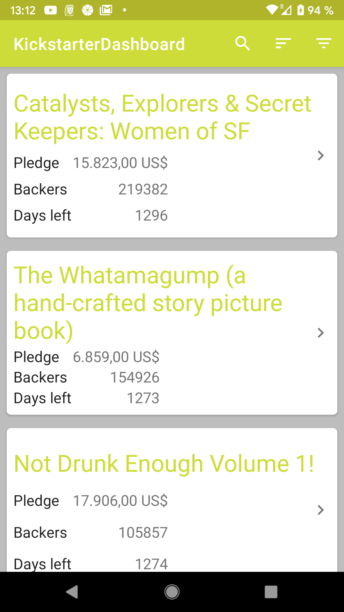
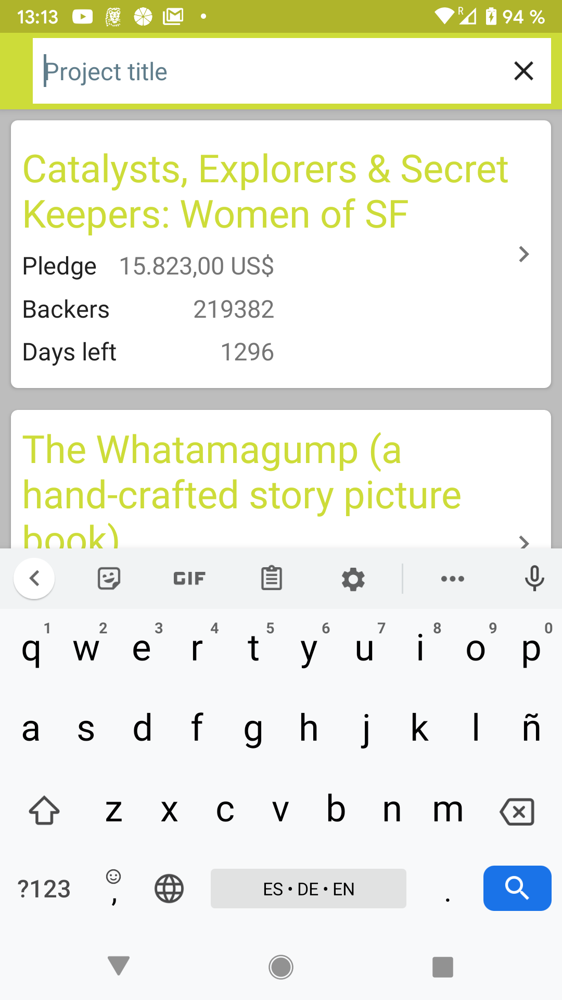
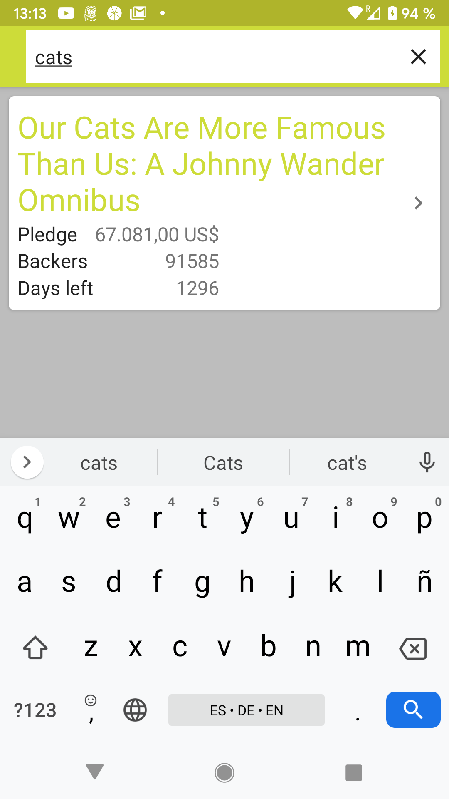
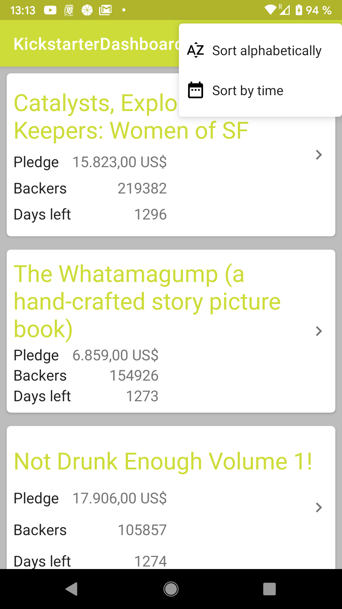
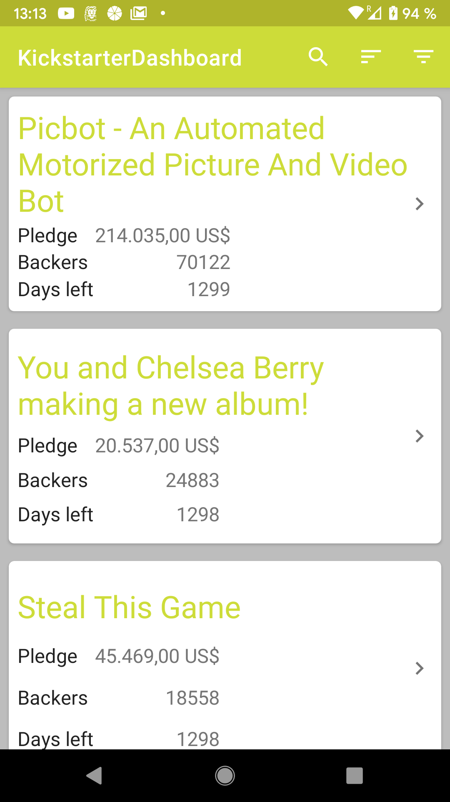
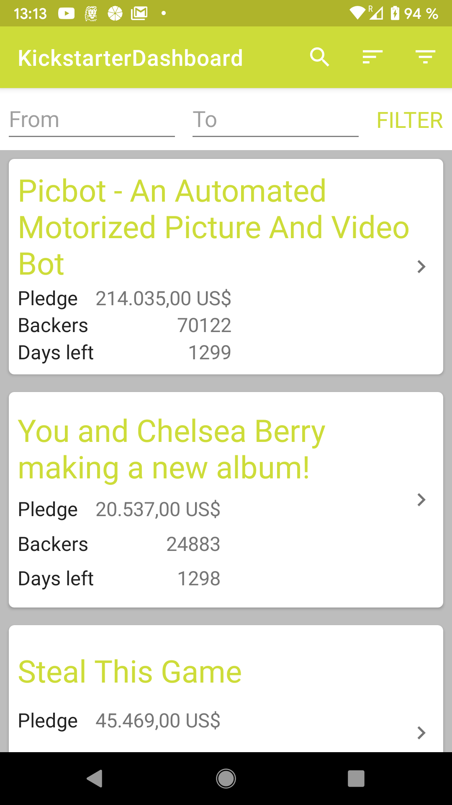
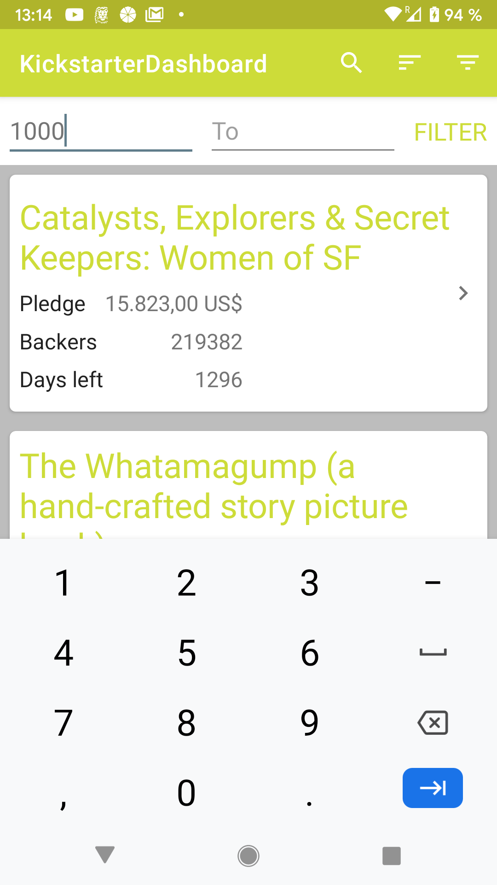

# KickstarterProjectsDashboard

KickstarterProjectsDashboard is an Android project developed during a 24-hours Android Practice Challenge by [Hackerearth](https://www.hackerearth.com/)

## Problem Statement

The goal is to develop a pseudo Mobile application(Android/iOS) which would list several Kickstarter.com projects and should also fulfill the following criteria:

#### Minimum Requirements
- [x] Use of Web API to fetch project details.

#### Plus Points
- [x] Implement a Search project by name​, filter by “No. of Backers”,  and Sort by time or alphabetically.
- [ ] Implement paging ​to display the results properly.
- [x] Cache all the API response in local storage and implement Infinite Scroll. 
- [ ] Fetch listings in sets of 20. When end is reached fetch another set from the local storage automatically.
- [x] Custom design, font and icons to make app more user ­friendly.
- [ ] You may add portfolio ​activity comprising awesome work you have done in Android/iOS.
- [x] Use your imagination and add features which would make things easier for end users.
- [x] We expect production level, generic, robust and standalone code.
- [x] Beautify; Comment; Documented code; handle Input Exceptions, Unicode and Null values.

#### Extra Work
- [ ] Perform Predictive Analysis on the provided data and predict the successful funding of pending projects. You should use variables like Amount Pledged, Number of backers, End Time among others, Where the benchmark for analysis would be completed funded closed/unclosed projects.
- [ ] As in calculate a benchmark that ‘x’ amount of money can be funded with ‘n’ number of backers in ‘y’ amount of time. Here you have to calculate average values of x,n,y.
- [ ] Plot beautiful graphs on the UI to visualize your analysis.
- [ ] Please feel free to perform more analysis and add more features in the webapp, which can make user experience amazing. More brownie points if you implement this.

## Screenshots

    
    
    
    
    
    
    
    
    

## Built With

* [Volley](https://github.com/google/volley) - The HTTP library used
* [RxJava](https://github.com/ReactiveX/RxJava) - A Java VM implementation of [Reactive Extensions](http://reactivex.io/): a library for composing asynchronous and event-based programs by using observable sequences.
* [Moshi](https://github.com/square/moshi/) - A modern JSON library for Android and Java
* [Timber](https://github.com/JakeWharton/timber) - A logger with a small, extensible API which provides utility on top of Android's normal Log class
* [Koin](https://insert-koin.io/) - A pragmatic lightweight dependency injection framework for Kotlin
* [Klock](https://github.com/korlibs/klock) - Date & Time library
* [Room](https://developer.android.com/topic/libraries/architecture/room) - Persistency library
